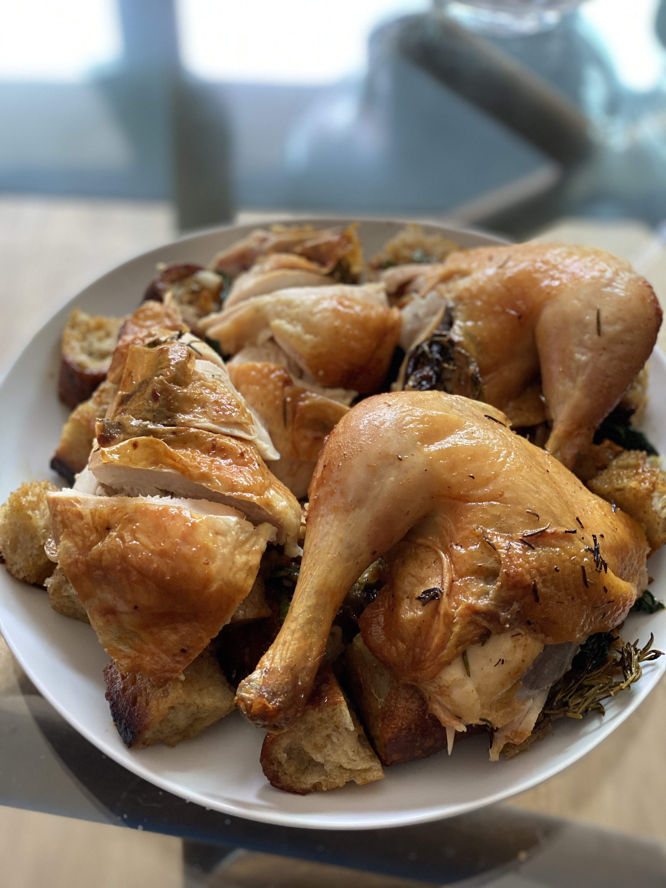

What could be more comforting than bread and chicken? 


### Ingredients:
```markdown
**For the chicken:**
- One whole chicken
- 4 tender sprigs fresh thyme, marjoram, rosemary, or sage

**For the bread salad:**
- 8 ounces slightly stale open-crumbed, chewy, peasant-style bread (not sourdough)
- 6 to 8 tablespoons mild-tasting olive oil
- 1 1/2 tablespoons Champagne vinegar or white wine vinegar
- 1 tablespoon dried currants
- 1 teaspoon red wine vinegar, or as needed
- 2 tablespoons pine nuts
- 2 to 3 garlic cloves, slivered
- 1/4 cup slivered scallions (~ 4 scallions)
- 2 tablespoons chicken stock or lightly salted water
- A few handfuls of arugula, frisée, or red mustard greens
```

### Instructions:
#### Season the chicken *(1-2 days before serving)*:
```markdown
1. Rinse and pat the chicken dry
2. Season the chicken liberally with salt 
```

#### Prep the bread salad *(several hours before serving)*:
```markdown
1. Preheat broiler
2. Cut or tear bread into chunks and remove crust
3. Brush bread with olive oil
4. Broil bread until it's crisp and lightly browned
5. Tear bread into smaller 2-3 in chunks
6. Combine 1/4 cup of olive oil with the Champagne or white wine vinegar. Use salt and pepper to taste.
7. Place the currants in a small bowl and moisten with the red wine vinegar and warm water. Set aside.
```

#### Roasting the chicken & Assembling the salad:
```markdown
1. Preheat oven to 475°
2. Preheat pan over medium heat. (Best to use a flameproof roasting pan or 10-in skillet)
3. Brush bread with olive oil
4. Broil bread until it's crisp and lightly browned
5. Tear bread into smaller 2-3 in chunks
6. Combine 1/4 cup of olive oil with the Champagne or white wine vinegar. Use salt and pepper to taste.
7. Place the currants in a small bowl and moisten with the red wine vinegar and warm water. Set aside.
```