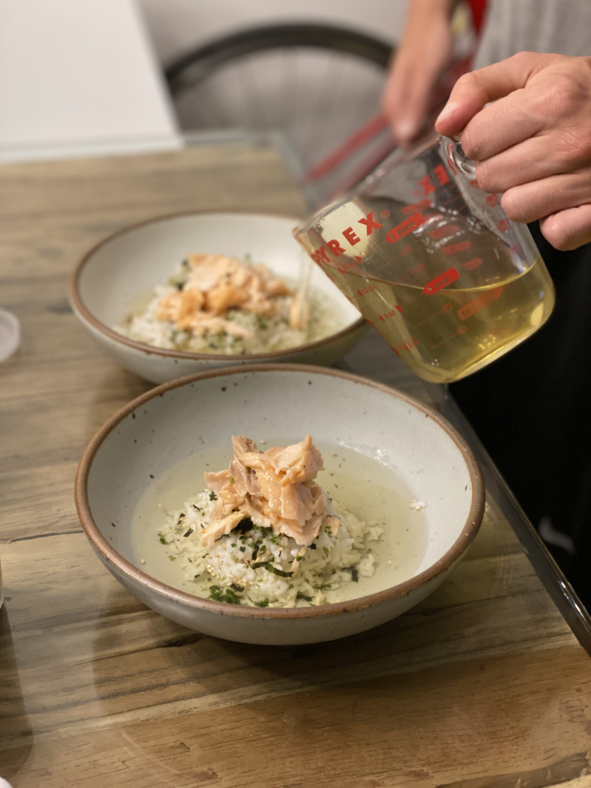
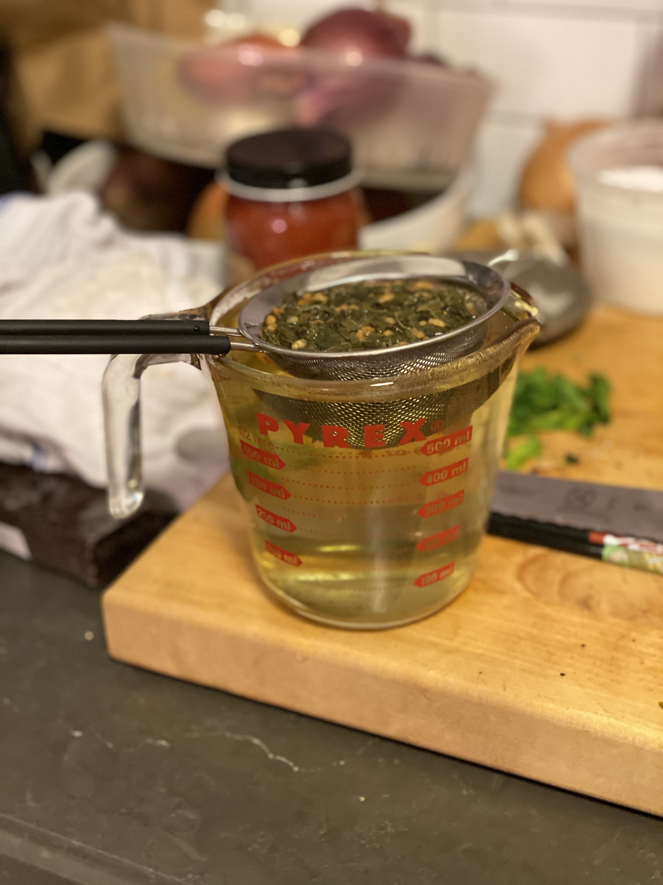
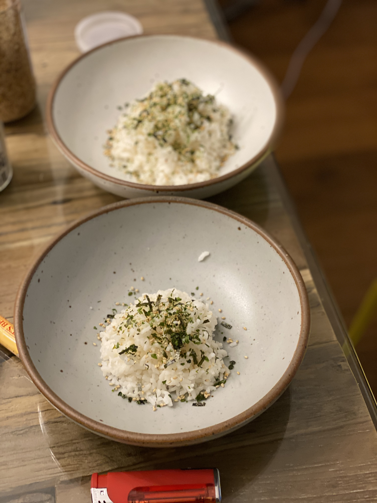
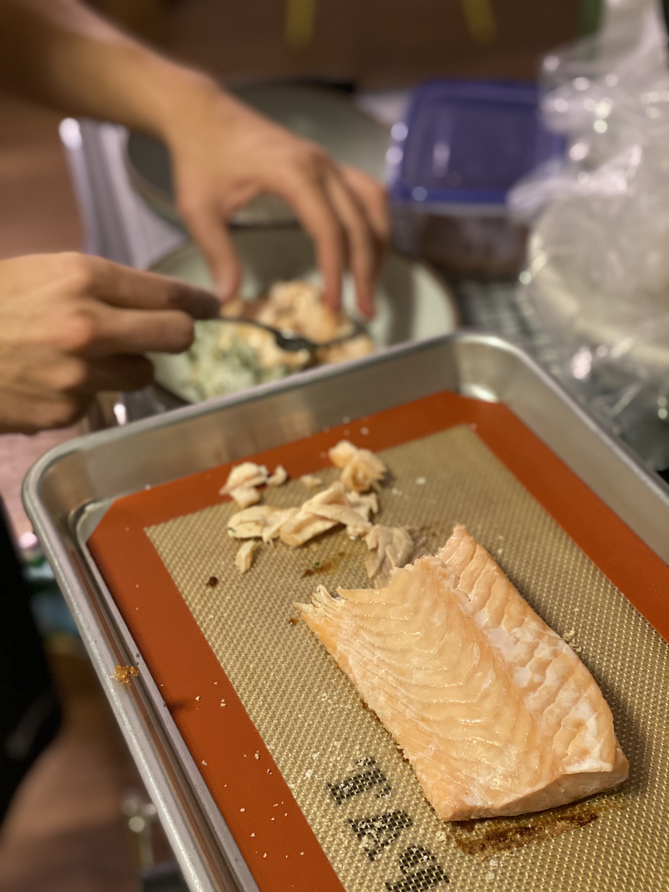

**From:** Just One Cookbook  
**Original recipe URL:** [Click here](https://www.justonecookbook.com/ochazuke/)

**Total time:** 1 hr | **Prep time:** 0 hr |  **Cook time:** 1 hr 


### Ingredients:
```markdown
- Green tea
- Salted salmon (Buy or prepare your own)
- Rice (any grain you prefer e.g. brown, white)
```


### Instructions:
```markdown
1. Brew green tea
2. Cook rice and add seasoning
3. Flake salted salmon on top of rice
4. Pour green tea over salmon and rice
```

### Additional notes:
- You can make a cold version of this dish using cold rice and tea
- You can substitute the salted salmon for other toppings such as: salmon roe, unagi, or umeboshi (sour pickled plum)

--- 

### Additional photos:

#### Brew the tea


#### Season the rice
	

#### Flake the salmon
	